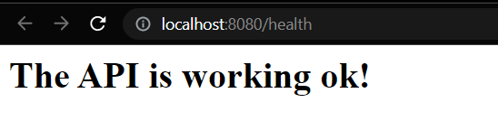
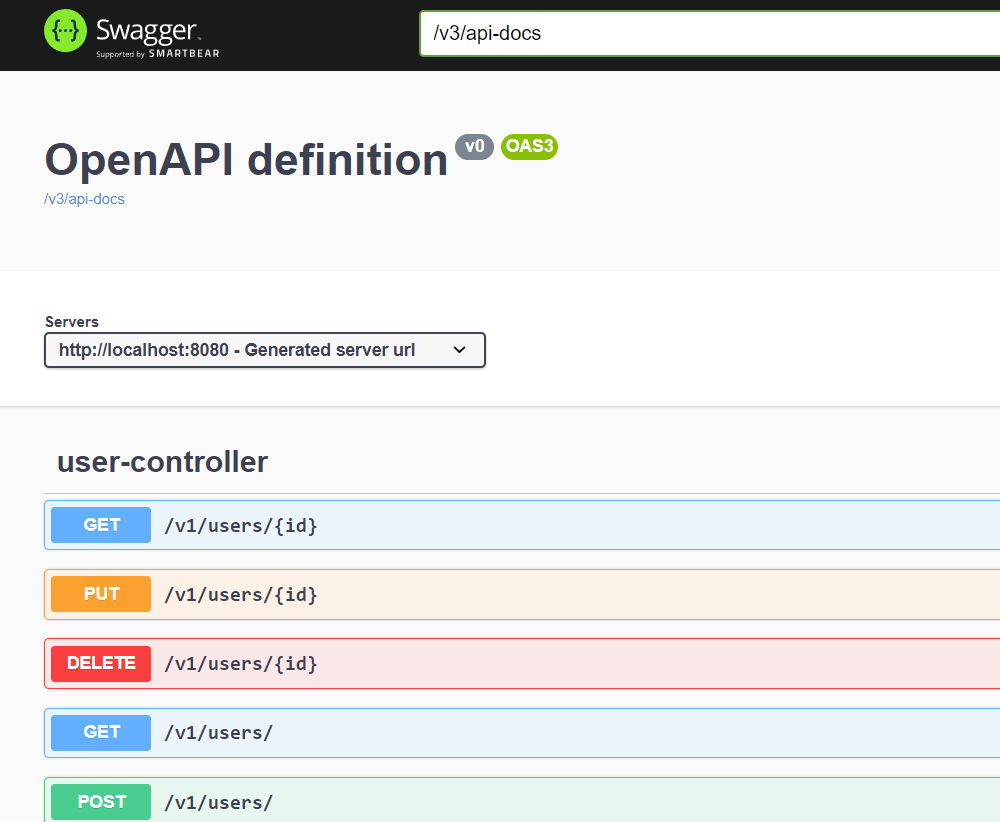
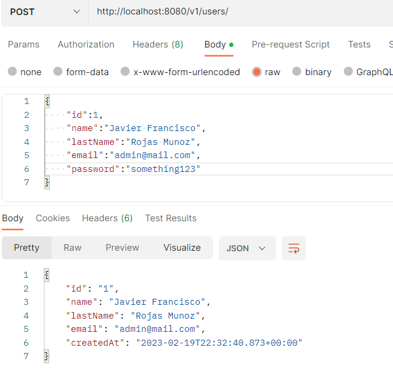
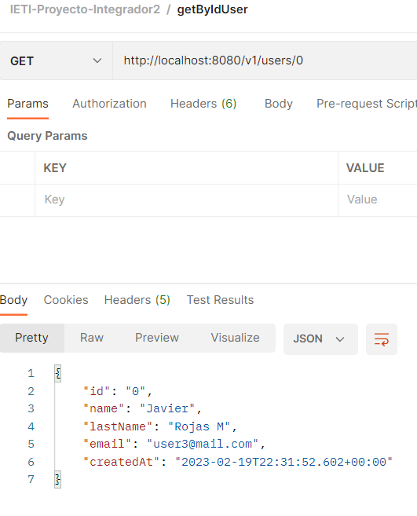
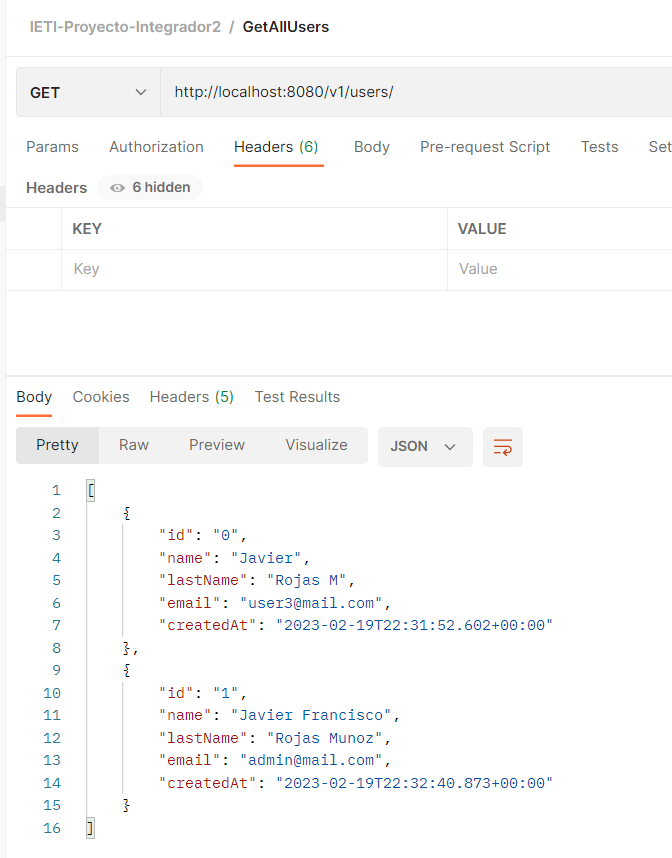
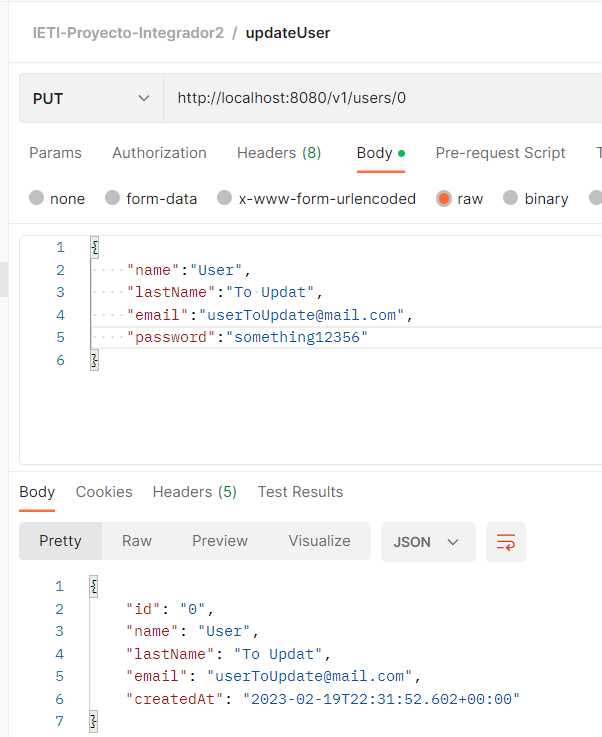
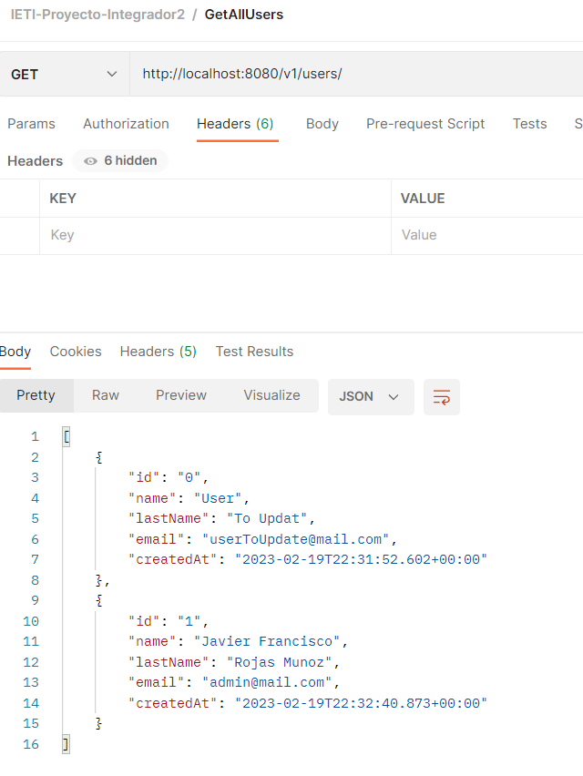
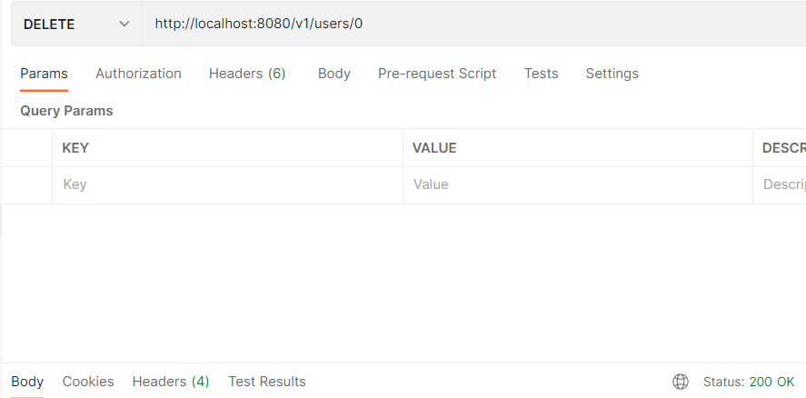
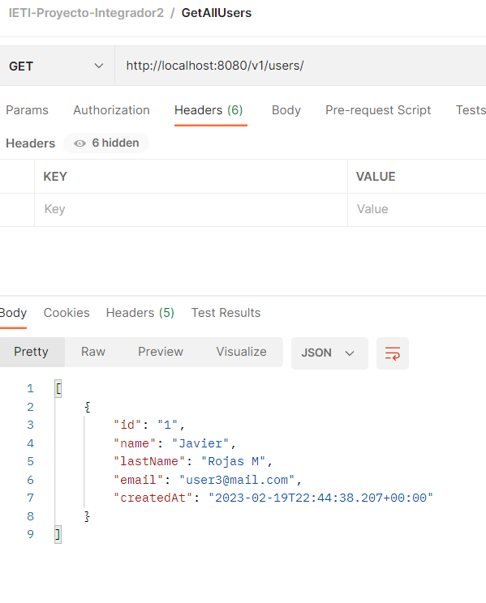

# proyecto
- Francisco Javier Rojas
- Juan Camilo Rojas
- Juan Felipe Aguas
- Diego Ruiz
- Yesid Camilo Mora

## Entrega 1 --- Proyecto Integrador: configuración inicial Booking System REST API.

## Entrega 2 ---  Proyecto Integrador: Implementa el controlador y servicio de tu api Rest
### CRUD
#### Swagger view
[http://localhost:8080/swagger-ui/index.html](http://localhost:8080/swagger-ui/index.html)

#### Create

#### Read

#### Update

#### Delete

## Entrega 3 ---  Proyecto Integrador: Implementar la capa de persistencia con Spring Data MongoDB 