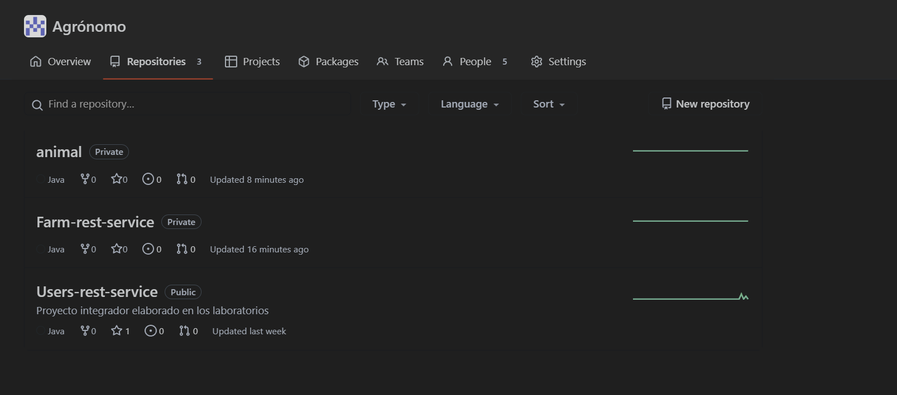

# proyecto
- Francisco Javier Rojas
- Juan Camilo Rojas
- Juan Felipe Aguas
- Diego Ruiz
- Yesid Camilo Mora

---
## Entrega 1 --- Proyecto Integrador: configuración inicial Booking System REST API.

---
## Entrega 2 ---  Proyecto Integrador: Implementa el controlador y servicio de tu api Rest
### CRUD
#### Swagger view
[http://localhost:8080/swagger-ui/index.html](http://localhost:8080/swagger-ui/index.html)

#### Create

#### Read

#### Update

#### Delete

---

## Sprint 1: API REST Nivel de Madurez 2

[http://localhost:8080/swagger-ui/index.html](http://localhost:8080/swagger-ui/index.html)

---
## Entrega 3 ---  Proyecto Integrador: Implementar la capa de persistencia con Spring Data MongoDB 

### ***Parte 1: Configuración y conexión con el cluster de MongoDB***

#### Ejecuta tu aplicación y verifica la conexión con tu cluster de MongoDB.

#### Verificar funcionamiento con postman y MongoDB Altas
***CRUD***

**Create**

**Read**

**Update**

**Delete**

---
## Sprint 2: Persistencia y Seguridad API REST

